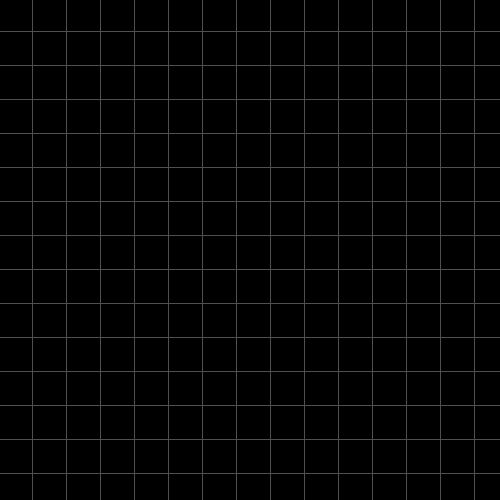
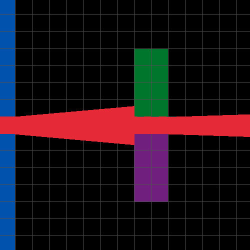
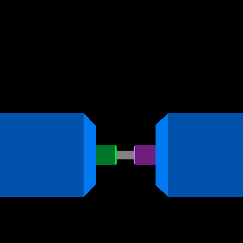
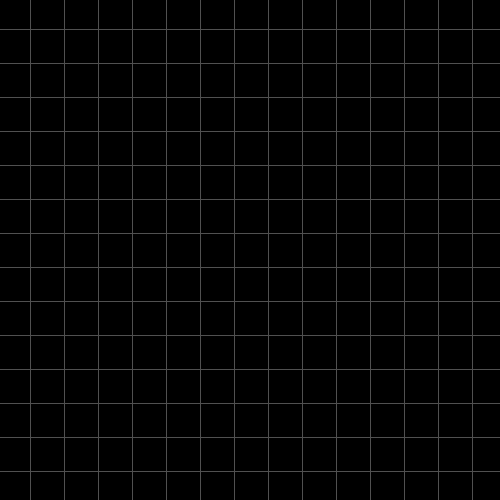

# mattlep11/raycaster
A customizable and playable 3D environment rendered using raycasting, implemented using C++ and the [Raylib](https://www.raylib.com/) drawing library. Utilizes the same computer graphics technique used to ship retro classics like DOOM and Wolfenstein 3D.

<div align="center" style="text-align: center;">
  <h3>Build your grid...</h3>
  Use the mouse on the grid builder to place tiles and build an environment to interact with.<br><br>
  
</div>
<br>
<div align="center" style="text-align: center;">
  <h3>... watch the rays cast...</h3>
  Use WASD to move around your new environment and watch as your view-cone adapts in real time.<br><br>
  
</div>
<br>
<div align="center" style="text-align: center;">
  <h3>... and explore your grid in first person!</h3>
  Swap to the first person perspective to move around what you've built.<br><br>
  
</div>

---

## What is raycasting?
Raycasting is an old method of rendering 3D environments by "casting" or projecting rays from the camera's position outwards until it collides with some object. As these rays are cast in 2D, the distance from the player's viewpoint to the collided object
must be translated into a single pixel wide line with a height that accurately represent's how far it is. By casting one ray per pixel of screen width, we can effectively re-create 3D scenes without the help of the z-axis.
<br><br>
The algorithm used in this project is known as DDA - the digital differential analysis algorithm. The layman's approach to finding the collision point between a ray and an object would be to gradually increase the ray's length by a small number 
and increment it until it hits. As you would expect, however, this is incredibly inefficient and wouldn't to support a full screen's worth of rays every frame. Alternatively, DDA makes the assertion that within a square grid where all cells are the same
width, we can instead increment by a calculated unit in either the x or y direction. In this case, the calculated unit is the deltaX or deltaY change needed to step one cell in either direction. This reduces the potentially hundreds of increments 
needed per ray into a reasonable amount such that **at least 25,000 rays can be used without dipping below 75 FPS.** Though of course, you only need as many as pixels in the screen size's width.

## How to run the project
This project was developed using C++ 17 and depends on the Raylib drawing library to run.<br>
**!! Note for Windows 10+ users, a preprepared .exe can be downloaded directly from the [releases tab](https://github.com/mattlep11/raycaster/releases).**

To set-up Raylib, consult the [official guide](https://github.com/raysan5/raylib/blob/master/README.md#build-and-installation) in their repo's README for your os of choice.

Afterwards, use the following to clone the repo to open in the IDE of your choice:
```
git clone https://github.com/mattlep11/raycaster.git
cd raycaster
```

## Resources used:
- [Raycasting Article (for the math and explanations)](https://lodev.org/cgtutor/raycasting.html) by Lode Vandevenne
- [Raycasting Video (for help fixing the fisheye distortion)](https://www.youtube.com/watch?v=gYRrGTC7GtA) by 3DSage

---

<div align="center" width="100%">
  
</div>
